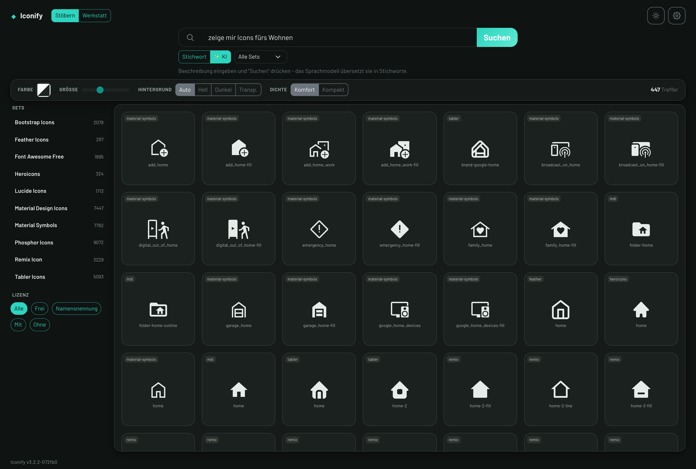

# Iconify

<p align="center">
  
</p>

Selbstgehosteter **Icon-Manager & Icon-Font-Generator**. Durchsucht und verwaltet
populäre Open-Source-Icon-Sets lokal, erzeugt daraus eigene Icon-Fonts und liefert
fertige Code-Snippets (SVG / IMG / Webfont) - ohne externe CDN-Abhängigkeit zur Laufzeit.

> Die Icons werden **nicht** mit dem Repository ausgeliefert. Jede Installation
> stößt den Import der gewünschten Sets selbst an (siehe "Nutzung"). So bleibt das
> Repo schlank und jede:r lädt nur, was gebraucht wird.

## Features

- **10 kuratierte Icon-Sets** (Tabler, Lucide, Bootstrap, Font Awesome Free, Heroicons,
  Feather, Remix, Phosphor, Material Symbols, Material Design Icons)
- **Import on-demand** aus den Originalquellen (GitHub-Trees-API), vollständig
  (kein 1000-Icon-Limit), wiederaufnehmbar, mit Live-Fortschritt
- **Globale Sofort-Suche** über alle Sets (In-Memory-Index) mit **stapelbaren Facetten**
  (Geltungsbereich · Lizenz [frei / Namensnennung / mit / ohne] · Stil)
- **KI-Prosa-Suche** (optional, via LM-Studio / OpenAI-kompatibel): Freitext → passende
  Icons. Ohne KI läuft die normale Suche unverändert weiter (graceful)
- **Globale Darstellung live** fürs ganze Grid (Farbe via Material-Palette · Größe ·
  Hintergrund hell/dunkel); **Klick = SVG kopieren**, ⌘K-Schnellsuche
- **Kuratier-Werkstatt**: Icons per Drag & Drop ins eigene Set übernehmen (mit Herkunft),
  eigene SVGs hochladen
- **Exporte**: Icon-Font (WOFF2 + CSS + Cheatsheet inkl. `ATTRIBUTION.txt`), **SVG-ZIP**,
  **Sprite-Sheet**, Einzel-Code (Inline-SVG / IMG / Webfont / CSS)
- **Lizenz-Transparenz**: Lizenz-Badge je Set + Attribution beim Export
- Hell/Dunkel (System/Auto), deutschsprachige Oberfläche, **kein externes CDN zur Laufzeit**

## Schnellstart

Voraussetzung: Docker + Docker Compose.

```bash
git clone git@github.com:HalloWelt42/Iconify.git
cd Iconify
docker compose up -d --build
```

Dann im Browser öffnen: **http://localhost:8766**

## Nutzung

1. In der Seitenleiste unter **"Verfügbar"** ein Set auswählen und auf **↓** klicken -
   das Set wird heruntergeladen (Fortschritt wird angezeigt).
2. Icons durchsuchen, ein Icon anklicken → Vorschau, Größe/Farbe, Code-Snippets.
3. Über das Sammlungs-Symbol Icons sammeln und einen **eigenen Icon-Font** erzeugen.
4. Eigene Sets über **+** anlegen und SVGs per Drag & Drop hinzufügen.

## Konfiguration

Einstellungen über Umgebungsvariablen (Prefix `ICONIFY_`). Vorlage: [`.env.example`](.env.example).

| Variable | Default | Zweck |
|---|---|---|
| `ICONIFY_PORT` | `8766` | HTTP-Port |
| `ICONIFY_MAX_CONCURRENT_DOWNLOADS` | `20` | parallele Downloads beim Import |
| `ICONIFY_GITHUB_TOKEN` | - | optional: höheres GitHub-API-Rate-Limit beim Import |

## Icon-Sets & Lizenzen

Iconify selbst steht unter der **MIT-Lizenz** (siehe [`LICENSE`](LICENSE)). Die importierten
Icons unterliegen den Lizenzen ihrer jeweiligen Projekte:

| Set | Lizenz (SPDX) |
|---|---|
| Tabler Icons | MIT |
| Lucide | ISC |
| Bootstrap Icons | MIT |
| Font Awesome Free | CC-BY-4.0 (Icons) - **Namensnennung nötig** |
| Heroicons | MIT |
| Feather | MIT |
| Remix Icon | Apache-2.0 |
| Phosphor | MIT |
| Material Symbols | Apache-2.0 |
| Material Design Icons | Apache-2.0 |

Beim Font-Export wird automatisch eine `ATTRIBUTION.txt` mit den passenden Lizenz-
und Quellenhinweisen erzeugt.

## Entwicklung

```bash
python3 -m venv .venv
.venv/bin/pip install -r requirements-dev.txt
.venv/bin/python -m pytest        # Tests
bash .githooks/install.sh          # Git-Hooks aktivieren
```

- Backend: FastAPI (`app/`), Icon-Quellen als Strategie-Muster (`app/services/sources.py`)
- Frontend: Single-Page Vanilla-JS (`app/static/`), Oberfläche auf Bootstrap 5
- Bootstrap-Theme: Quelle `theme/src/iconify.scss`, erzeugt `app/static/vendor/iconify.css`
  (`cd theme && npm install && npm run build`); Bootstrap-JS und die Schrift Barlow liegen
  mit `npm run vendor:js` bzw. `npm run vendor:fonts` unter `app/static/vendor/` - zur Laufzeit
  wird nichts nachgeladen
- Daten: SVG-Dateien unter `icons/<set>/…`, Metadaten als `meta.json`
- Versionierung: `version.json` ist die einzige Quelle. `tools/version.sh [patch|minor|major|id]`
  zählt hoch und vergibt eine neue Build-Kennung; der Pre-Commit-Hook in `tools/git-hooks/`
  erzwingt bei jedem Commit eine eigene Version (einmalig aktivieren mit
  `git config core.hooksPath tools/git-hooks`). Backend und Oberfläche lesen die Nummer
  über `/health`, sie steht unten links in der Oberfläche - nirgends fest geschrieben.
- Branch: `dev`

**Ausführliche technische Dokumentation:** [docs/DOKUMENTATION.md](docs/DOKUMENTATION.md)
- Aufbau in Schichten, Ablage auf der Platte und der Pfadvertrag
- Import der Sammlungen (Strategie je Quelle, paralleles Laden, Wiederaufnahme)
- Suchindex im Arbeitsspeicher und die Abfragen dahinter
- KI-Suche Schritt für Schritt auf Codeebene
- Erzeugung von SVG, Sprite und Icon-Schrift
- Betriebsbuch und Glossar

---

## Unterstützen

Iconify ist ein privates Hobby-Projekt. Kein Tracking, keine Werbung, keine Kompromisse.

Wenn dir das Projekt gefällt, kannst du es weitersagen -- oder direkt hier:

[](https://ko-fi.com/HalloWelt42)

**Crypto:**

| Coin | Adresse |
|------|---------|
| BTC | `bc1qnd599khdkv3v3npmj9ufxzf6h4fzanny2acwqr` |
| DOGE | `DL7tuiYCqm3xQjMDXChdxeQxqUGMACn1ZV` |
| ETH | `0x8A28fc47bFFFA03C8f685fa0836E2dBe1CA14F27` |

In der Oberfläche steht dasselbe hinter dem Herz unten links, dort mit QR-Codes.

## Lizenz

[MIT](LICENSE) © HalloWelt42
