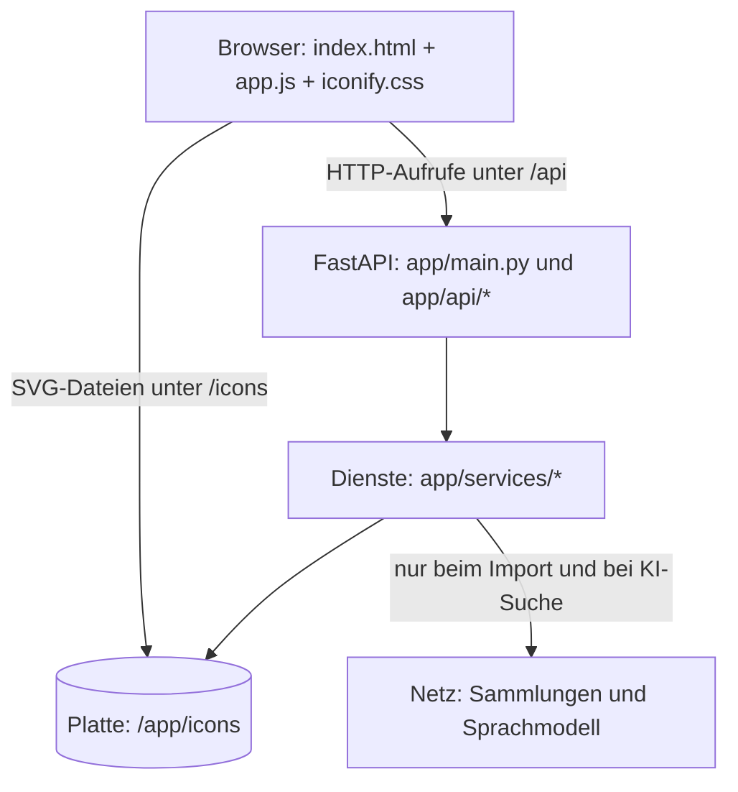
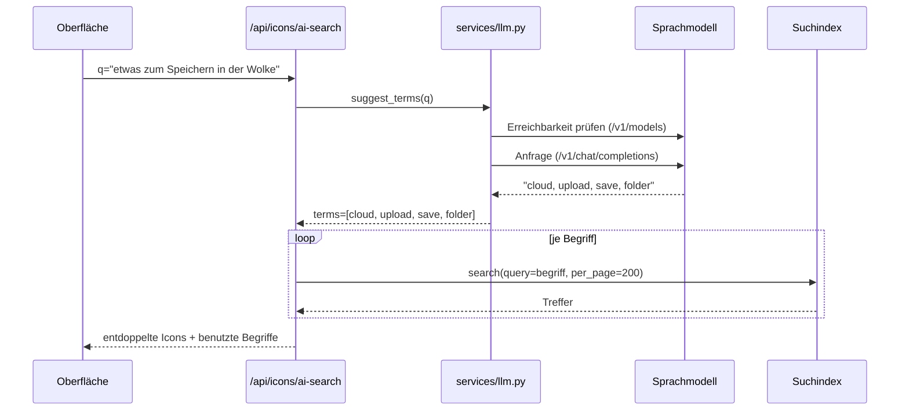

# Iconify - technische Dokumentation

Diese Dokumentation erklärt, wie Iconify aufgebaut ist und wie es arbeitet: vom
Import der Icons über den Suchindex und die KI-Suche bis zu den erzeugten
Ausgaben (SVG, Sprite, Icon-Schrift). Sie ist so geschrieben, dass man ohne
Vorwissen über das Projekt einsteigen kann. Fachbegriffe stehen im Glossar am
Ende.

**Kurzfassung in drei Sätzen:** Iconify lädt Icon-Sammlungen aus dem Netz
einmalig auf die eigene Platte. Ein Index im Arbeitsspeicher macht diese Dateien
durchsuchbar, wahlweise per Stichwort oder per Beschreibung, die ein
Sprachmodell in Stichworte übersetzt. Aus einer Auswahl erzeugt der Dienst
fertige Artefakte: eingefärbtes SVG, ein Bild-Tag, ein Sprite oder eine
komplette Icon-Schrift.

---

## Inhalt

1. [Überblick und Leitgedanken](#1-überblick-und-leitgedanken)
2. [Landkarte des Systems](#2-landkarte-des-systems)
3. [Ablage auf der Platte](#3-ablage-auf-der-platte)
4. [Weg 1: Icon-Sets importieren](#4-weg-1-icon-sets-importieren)
5. [Weg 2: Der Suchindex](#5-weg-2-der-suchindex)
6. [Weg 3: Die KI-Suche im Detail](#6-weg-3-die-ki-suche-im-detail)
7. [Weg 4: Code-Erzeugung für ein einzelnes Icon](#7-weg-4-code-erzeugung-für-ein-einzelnes-icon)
8. [Weg 5: Werkstatt und Exporte](#8-weg-5-werkstatt-und-exporte)
9. [Die Oberfläche](#9-die-oberfläche)
10. [Lizenzen als durchgehender Faden](#10-lizenzen-als-durchgehender-faden)
11. [Versionierung, Bau und Auslieferung](#11-versionierung-bau-und-auslieferung)
12. [Betriebsbuch: typische Fehlerbilder](#12-betriebsbuch-typische-fehlerbilder)
13. [Wo was steht](#13-wo-was-steht)
14. [Glossar](#14-glossar)

---

## 1. Überblick und Leitgedanken

Iconify ist ein Dienst, der auf einem eigenen Rechner im eigenen Netz läuft. Er
löst drei Probleme:

1. **Finden.** Icon-Sammlungen sind gross. Wer den englischen Namen nicht kennt,
   sucht lange. Iconify durchsucht alle Sammlungen gleichzeitig und versteht auf
   Wunsch auch eine Beschreibung in ganzen Sätzen.
2. **Rechtssicherheit.** Jede Sammlung hat eine Lizenz. Manche verlangen eine
   Namensnennung. Iconify führt diese Information von der Konfiguration bis in
   die erzeugte Datei mit.
3. **Unabhängigkeit.** Die Icons liegen lokal. Eine Seite, die sie einbindet,
   fragt nirgends im Internet nach.

Vier Leitgedanken ziehen sich durch den ganzen Code:

- **Dateien sind die Wahrheit, der Index ist Beiwerk.** Was es gibt, steht als
  SVG-Datei auf der Platte. Der Suchindex ist eine Ableitung davon und jederzeit
  neu baubar. Geht er verloren, ist nichts verloren.
- **Deklarativ vor imperativ.** Was eine Icon-Sammlung ausmacht (Quelle, Stile,
  Lizenz, Schrift-Präfix), steht als Datensatz in `app/config.py`, nicht als
  Sonderfall im Programmablauf.
- **Zusatzfunktionen dürfen nie das Grundgerüst umwerfen.** Die KI-Suche ist
  optional. Ist kein Sprachmodell erreichbar, funktioniert alles andere
  unverändert weiter, ohne Fehlermeldung im Betrieb.
- **Eine Wahrheit je Sache.** Die Version steht in `version.json`, die
  Farbpalette in einer SCSS-Datei, der Pfadaufbau der Icons an genau einer
  Stelle.

---

## 2. Landkarte des Systems



Vier Schichten, jede mit einer Aufgabe:

| Schicht | Ort | Aufgabe | Kennt |
|---|---|---|---|
| Oberfläche | `app/static/` | Anzeigen und Bedienen | nur die HTTP-Schnittstelle |
| Schnittstelle | `app/api/` | Anfragen prüfen, Antworten formen | die Dienste |
| Dienste | `app/services/` | die eigentliche Arbeit | die Platte und das Netz |
| Konfiguration | `app/config.py` | Beschreibung aller Sammlungen | nichts |

Wichtig ist die Richtung der Pfeile: die Oberfläche kennt die Dienste nicht, die
Dienste kennen die Oberfläche nicht. Man kann jede Schicht austauschen, ohne die
anderen anzufassen. Beispiel: die Oberfläche wurde in Version 3.1.0 komplett neu
gebaut, ohne dass eine einzige Zeile in `app/services/` geändert werden musste.

`app/main.py` verdrahtet das Ganze:

```python
app = FastAPI(title="Iconify", version=__version__)

app.include_router(sets.router,   prefix="/api/sets",   tags=["sets"])
app.include_router(icons.router,  prefix="/api/icons",  tags=["icons"])
app.include_router(font.router,   prefix="/api/font",   tags=["font"])
app.include_router(custom.router, prefix="/api/custom", tags=["custom"])
app.include_router(export.router, prefix="/api/export", tags=["export"])
app.include_router(llm.router,    prefix="/api/llm",    tags=["llm"])

app.mount("/static", StaticFiles(directory="app/static"), name="static")
app.mount("/icons",  StaticFiles(directory=str(ICONS_PATH)), name="icons")
```

Der zweite `mount` ist der Grund, warum die Oberfläche Icons ohne Umweg anzeigen
kann: die Dateien werden direkt als statische Dateien ausgeliefert. Für 120
Kacheln bedeutet das 120 kleine Anfragen, die der Webserver ohne Python
beantwortet.

---

## 3. Ablage auf der Platte

Alles liegt unter `/app/icons` (im Container ein eingehängtes Verzeichnis, damit
ein Neubau des Abbilds die Daten nicht wegwirft):

```
/app/icons/
  tabler/
    meta.json                 <- was der letzte Import wirklich geschafft hat
    outline/alarm.svg
    filled/alarm.svg
  lucide/
    alarm-clock.svg           <- Sammlung ohne Stile: flach
  heroicons/
    24/outline/bell.svg       <- Stil kann mehrstufig sein
  custom-steuerpult/
    start.svg                 <- eigenes Set, immer flach
  _custom_sets.json           <- Verzeichnis der eigenen Sets
  _llm_config.json            <- Einstellungen der KI-Suche
```

**Der Pfadvertrag.** Der Aufbau `icons/<set>/<stil>/<name>.svg` ist keine
Nebensache, sondern eine Absprache, auf die sich mehrere Bausteine verlassen:

- der Import legt die Dateien so ab (`IconSource.target_path`),
- der Index leitet den Stil aus dem Verzeichnis ab (alles zwischen Set-Ordner
  und Dateiname),
- die Oberfläche baut daraus die Bild-Adresse `/icons/<set>/<stil>/<name>.svg`,
- Export und Schrift-Erzeugung finden die Quelldateien darüber wieder.

Wer den Aufbau ändert, muss alle vier Stellen anfassen. Deshalb steht die Regel
an einer Stelle im Code und wird überall wiederverwendet.

**Warum die Icons nicht im Repository liegen:** es sind über 38.000 Dateien
fremder Projekte mit eigenen Lizenzen. Jede Installation lädt sich selbst, was
sie braucht. Das Repository bleibt klein und enthält keine fremden Werke.

---

## 4. Weg 1: Icon-Sets importieren

### 4.1 Die Beschreibung einer Sammlung

Eine Sammlung ist ein Datensatz vom Typ `IconSetConfig` (Pydantic-Modell, also
mit geprüften Feldtypen). Auszug aus `app/config.py`:

```python
"tabler": IconSetConfig(
    id="tabler",
    name="Tabler Icons",
    source_type="github_tree",           # welche Strategie das Laden übernimmt
    github_repo="tabler/tabler-icons",
    github_branch="main",
    github_tree_path="icons",            # Unterordner im Projekt
    styles=["outline", "filled"],
    license="MIT",
    license_spdx="MIT",
    license_category="permissive",       # permissive | attribution
    requires_attribution=False,
    font_prefix="ti",                    # Klassen-Präfix der Original-Schrift
),
```

Neue Sammlung aufnehmen heisst: einen solchen Eintrag ergänzen. Kein neuer
Programmzweig, kein `if set_id == "..."` irgendwo im Ablauf. Das Feld
`source_type` entscheidet, welcher Lade-Weg genommen wird.

### 4.2 Drei Quellen, ein Vertrag (Strategie-Muster)

Icon-Projekte veröffentlichen ihre Icons unterschiedlich. Damit diese
Unterschiede nicht in den Ablauf sickern, gibt es in `app/services/sources.py`
eine gemeinsame Schnittstelle mit drei Umsetzungen:

```python
class IconSource(ABC):
    @abstractmethod
    async def fetch_icon_list(self, session) -> list[dict]: ...   # was gibt es?
    def source_url(self, icon: dict) -> str: ...                  # wo liegt es?
    def target_path(self, out: Path, icon: dict) -> Path: ...     # wohin lokal?
```

| Strategie | Für wen | Wie sie die Liste holt |
|---|---|---|
| `JsonKeysSource` | Sammlungen mit einer JSON-Datei, deren Schlüssel die Namen sind | Datei laden, `data.keys()` |
| `FontAwesomeJsonSource` | eine Sammlung, in der jedes Icon mehrere Stile hat | pro Icon die erlaubten Stile aufklappen |
| `GithubTreeSource` | Sammlungen ohne Metadatendatei | den Dateibaum des Projekts abfragen |

Ausgewählt wird über eine Registry samt Fabrikfunktion - das ist die ganze
Verzweigung im System:

```python
_SOURCE_REGISTRY = {
    "json_keys": JsonKeysSource,
    "fontawesome_json": FontAwesomeJsonSource,
    "github_tree": GithubTreeSource,
}

def create_source(config: IconSetConfig) -> IconSource:
    cls = _SOURCE_REGISTRY.get(config.source_type)
    if cls is None:
        raise ValueError(f"Unbekannter source_type: {config.source_type!r}")
    return cls(config)
```

**Warum der Dateibaum und nicht die Verzeichnisliste?** Die naheliegende
Schnittstelle zum Auflisten eines Ordners liefert höchstens 1000 Einträge. Zwei
Sammlungen haben mehr, und die Zählung war entsprechend zu klein. Der Weg über
den Baum (`/git/trees/{sha}?recursive=1`) liefert alle Dateien in einem einzigen
rekursiven Aufruf. Der Code hangelt sich dafür zuerst vom Zweig zur Kennung des
gewünschten Unterordners und listet dann diesen Unterbaum auf. Meldet die
Antwort `truncated`, schreibt der Dienst eine Warnung ins Protokoll, statt still
ein unvollständiges Set zu behaupten.

### 4.3 Der Ablauf des Imports

`app/services/downloader.py` orchestriert und kennt dabei keine einzige
Sammlung namentlich:

```python
source = create_source(config)
icon_list = await source.fetch_icon_list(session)      # 1. was gibt es?

tasks = [
    self._download_single(session,
                          source.source_url(icon),      # 2. laden
                          source.target_path(output_dir, icon),
                          progress)
    for icon in icon_list
]
await asyncio.gather(*tasks, return_exceptions=True)   # 3. parallel abarbeiten
```

Vier Eigenschaften sind bewusst so gebaut:

**Parallel, aber gedeckelt.** Tausende Downloads gleichzeitig würden die
Gegenstelle überfahren. Ein Semaphor lässt nur so viele gleichzeitig zu, wie in
`settings.max_concurrent_downloads` steht (Vorgabe 20). Weil Warten auf das Netz
kein Rechnen ist, ist asynchrone Verarbeitung hier genau richtig: ein einzelner
Prozess hält problemlos zwanzig offene Verbindungen.

**Wiederaufnehmbar.** Der erste Blick gilt der Platte:

```python
if path.exists():
    progress.completed += 1
    return {"status": "skipped"}
```

Ein abgebrochener Import kann einfach erneut gestartet werden. Er macht dort
weiter, wo er aufgehört hat. Der Fachbegriff dafür ist idempotent: mehrfaches
Ausführen ändert nichts am Ergebnis.

**Höflich bei Gegenwehr.** Wiederholungen laufen als Schleife, nicht als
Rekursion, und zwar innerhalb des Semaphors:

```python
for attempt in range(1, max_attempts + 1):
    async with session.get(url) as response:
        if response.status == 200: ...   # fertig
        if response.status == 429:       # zu viele Anfragen
            retry = min(int(response.headers.get("Retry-After", 5)), 15)
            await asyncio.sleep(retry + attempt)
            continue
        if response.status in (500, 502, 503, 504):
            await asyncio.sleep(attempt)  # der Server hat gerade Schluckauf
            continue
```

Ein rekursiver Wiederholungsversuch würde den Semaphor ein zweites Mal
anfordern, den er noch hält. Das Ergebnis wäre ein Deadlock: der Import stünde
still und niemand wüsste warum. Die Schleife vermeidet das.

**Ehrliche Zahlen.** Nach dem Lauf wird nicht gezählt, was geplant war, sondern
was tatsächlich auf der Platte liegt:

```python
svg_files = list(output_dir.glob("**/*.svg"))
meta = {"icon_count": len({p.stem for p in svg_files}),
        "total_files": len(svg_files),
        "failed": progress.failed,
        "downloaded_at": datetime.now().isoformat()}
(output_dir / "meta.json").write_text(json.dumps(meta, indent=2))
```

`icon_count` zählt Namen, `total_files` zählt Dateien. Ein Icon in drei Stilen
sind ein Name und drei Dateien. Genau diese Zahl steht später in der Seitenleiste.

**Fortschritt ohne Sitzungszustand.** Ein `DownloadProgress`-Objekt je Set liegt
im Speicher des Dienstes. Die Oberfläche fragt es alle 900 Millisekunden über
`GET /api/sets/{id}/progress` ab. Kein WebSocket, keine Sitzung, kein
Zwischenspeicher: die einfachste Lösung, die für diesen Zweck reicht.

Zum Schluss wird der Suchindex neu gebaut - in einem Arbeitsstrang, damit die
Ereignisschleife nicht blockiert:

```python
await asyncio.to_thread(search_index.build)
```

---

## 5. Weg 2: Der Suchindex

### 5.1 Warum überhaupt ein Index?

Eine Suche über 38.000 Dateien durch Durchlaufen der Verzeichnisse dauert bei
jedem Tastendruck viel zu lange. Also wird einmal gelesen und in eine Tabelle
geschrieben, gegen die sich schnell abfragen lässt.

Die Tabelle liegt in einer Datenbank im **Arbeitsspeicher**
(`sqlite3.connect(":memory:")`). Das ist eine bewusste Entscheidung: der Index
ist eine Ableitung, keine Wahrheit. Er darf beim Neustart verschwinden, weil er
sich in Sekunden aus den Dateien neu aufbauen lässt. Damit gibt es keine
Datenbankdatei, die veralten, kaputtgehen oder gesichert werden müsste.

### 5.2 Der Aufbau

```python
c.execute("CREATE TABLE icons(set_id TEXT, name TEXT, style TEXT, path TEXT, "
          "is_custom INT, lic_cat TEXT, lic_spdx TEXT)")
```

Gefüllt wird aus dem Dateibaum. Hier zahlt sich der Pfadvertrag aus - der Stil
muss nirgends gespeichert werden, er steht im Pfad:

```python
for f in d.glob("**/*.svg"):
    rel = f.relative_to(d)
    parts = rel.parts
    style = "/".join(parts[:-1]) if len(parts) > 1 else ""
    path = "/icons/" + sid + "/" + rel.with_suffix("").as_posix()
    rows.append((sid, f.stem, style, path, 0, cat, spdx))
```

Die Lizenzangaben werden bewusst **in jede Zeile kopiert**. In einer normalisierten
Datenbank wäre das ein Fehler, hier ist es Absicht: der Index ist ein
Wegwerfobjekt, und ein Lizenzfilter soll ohne Verknüpfung mehrerer Tabellen
funktionieren.

### 5.3 Austausch ohne Aussetzer

Ein Neubau darf laufende Suchen nicht stören. Deshalb wird die neue Tabelle
vollständig aufgebaut und erst dann eingehängt:

```python
global _conn
with _LOCK:
    old, _conn = _conn, conn      # ein einziger Zuweisungsschritt
if old:
    old.close()
```

Zu keinem Zeitpunkt existiert ein halb gefüllter Index. Anfragen, die während
des Baus laufen, arbeiten auf der alten Tabelle zu Ende. Für einzelne Änderungen
(ein Icon zu einem eigenen Set hinzugefügt) gibt es `refresh_set`, das nur die
Zeilen eines Sets ersetzt, statt alles neu zu lesen.

Das `threading.Lock` ist nötig, weil FastAPI Anfragen in mehreren Arbeitssträngen
bedient und eine Verbindung mit `check_same_thread=False` geöffnet wird.

### 5.4 Die Abfrage

`search()` baut die Bedingungen zusammen und verknüpft sie mit UND:

| Achse | Werte | wird zu |
|---|---|---|
| Bereich | `set`, `all`, `custom` | `set_id=?` bzw. `is_custom=1` bzw. nichts |
| Lizenz | `permissive`, `attribution`, `with`, `without` | `lic_cat=...` |
| Text | Suchbegriff | `name LIKE '%begriff%'` |
| Stil | z. B. `outline` | `style=?` |

Ein Detail lohnt den zweiten Blick. Ohne Stilfilter würde ein Icon, das in fünf
Stilen vorliegt, fünfmal im Raster erscheinen. Deshalb wird gruppiert:

```python
base = ("SELECT set_id,name,MIN(style) s,MIN(path) p FROM icons" + wsql +
        " GROUP BY set_id,name")
```

`MIN(style)` wählt stellvertretend einen Stil aus - welchen, ist egal, weil der
Detailbereich später ohnehin alle Stile anbietet. Mit Stilfilter entfällt die
Gruppierung, dann sind die Treffer bereits eindeutig.

Die Gesamtzahl wird über die gleiche Abfrage als Unterabfrage gezählt
(`SELECT COUNT(*) FROM (...)`), damit Zähler und Seiten immer zusammenpassen.
Geblättert wird klassisch mit `LIMIT` und `OFFSET`; die Oberfläche lädt beim
Scrollen nach.

**Ehrliche Grenzen.** `LIKE '%begriff%'` findet Teilzeichenketten ohne Rangfolge:
Wer "home" sucht, bekommt "home" und "chrome" gleichwertig. Für die Sofortsuche
über Namen reicht das und es kostet keine Abhängigkeit. Wenn später Rangfolge
oder Synonyme gebraucht werden, ist die Volltextsuche der Datenbank (FTS5) der
nächste Schritt - der Rest des Systems müsste sich dafür nicht ändern, weil alles
hinter `search_index.search()` liegt.

---

## 6. Weg 3: Die KI-Suche im Detail

### 6.1 Das Problem

Icon-Namen sind englisch, knapp und folgen der Logik der jeweiligen Sammlung.
Wer "etwas zum Speichern von Dateien in der Wolke" sucht, tippt vielleicht
"speichern", "wolke", "cloud", "save" und findet mal etwas, mal nichts. Ein
Sprachmodell ist gut in genau dieser Übersetzung: aus einer Beschreibung
mehrere passende Fachbegriffe machen.

Wichtig ist, was das Modell **nicht** tut: es sucht nicht, es bewertet keine
Icons, es sieht keine Bilder. Es liefert nur Suchbegriffe. Die eigentliche Suche
macht weiterhin der Index. Damit bleibt das Ergebnis nachvollziehbar, und ohne
Modell fällt nur die Übersetzung weg, nicht die Suche.

### 6.2 Der Ablauf in fünf Schritten



### 6.3 Schritt 1 und 2: Einstellungen und Erreichbarkeit

Die Einstellungen liegen als Datei im Icon-Verzeichnis, nicht im Abbild - so
überleben sie einen Neubau des Containers:

```python
CONFIG_FILE = ICONS_PATH / "_llm_config.json"
DEFAULTS = {"base_url": "http://192.168.178.51:1234", "model": "",
            "enabled": True, "timeout": 45}
```

Geschrieben wird **atomar**: erst in eine Nebendatei, dann umbenennen.

```python
tmp = CONFIG_FILE.with_suffix(".tmp")
tmp.write_text(json.dumps(cfg, indent=2))
tmp.replace(CONFIG_FILE)
```

Das Umbenennen ist im Dateisystem ein einziger Schritt. Fällt der Strom mitten
im Schreiben aus, existiert entweder die alte oder die neue Datei, nie eine halb
geschriebene.

`check()` fragt die Modellliste ab und ist der Gesundheitstest:

```python
async with s.get(base + "/v1/models") as r:
    if r.status != 200:
        return {"connected": False, "models": [], "error": f"HTTP {r.status}"}
    data = await r.json()
    return {"connected": True, "models": [m.get("id", "") for m in data.get("data", [])]}
```

Beachte das Muster: **kein `raise`**. Jeder Fehler wird zu einem Rückgabewert
`{"connected": False, "error": ...}`. Die Oberfläche zeigt daraufhin einen
Hinweis, statt dass eine Ausnahme durch die Schichten nach oben schlägt. Genau
das macht die KI zu einer Zutat und nicht zu einer Voraussetzung.

### 6.4 Schritt 3: Die Anfrage an das Modell

```python
prompt = (f'Ein Nutzer sucht ein passendes Icon für: "{query}". '
          f"Gib 3 bis 8 ENGLISCHE Icon-Suchbegriffe (einzelne Wörter, wie sie in "
          f"Icon-Bibliotheken vorkommen, z. B. home, trash, arrow-left). "
          f"Antworte NUR mit den Begriffen, kommagetrennt, ohne Erklärung.")

payload = {"model": model,
           "messages": [{"role": "user", "content": prompt}],
           "temperature": 0.2,
           "max_tokens": 60,
           "stream": False}
```

Jede Zahl in diesem Aufruf hat einen Grund:

- **Englisch verlangt**, weil die Icon-Namen englisch sind.
- **3 bis 8 Begriffe**: unter drei wird die Trefferliste dünn, über acht wird sie
  beliebig, und jede zusätzliche Abfrage kostet Zeit.
- **Beispiele im Auftrag** (`home, trash, arrow-left`) zeigen die gewünschte
  Form. Ein Modell ahmt Beispiele zuverlässiger nach als Beschreibungen.
- **`temperature: 0.2`** hält die Antwort nah am Wahrscheinlichsten. Bei einer
  Suche will man Wiederholbarkeit, keine Kreativität.
- **`max_tokens: 60`** deckelt die Antwortlänge. Acht Wörter brauchen keine
  Romanlänge, und die Obergrenze verhindert, dass ein geschwätziges Modell die
  Anfrage in die Länge zieht.
- **`stream: False`**, weil erst die vollständige Liste nützlich ist.
- **Modellwahl**: ist keines eingestellt, nimmt der Dienst das erste, das der
  Server meldet.

### 6.5 Schritt 4: Die Antwort säubern

Ein Sprachmodell hält sich nicht garantiert an das Format. Also wird die Antwort
nicht geglaubt, sondern zerlegt und gefiltert:

```python
terms = [t.strip().lower() for t in re.split(r"[,\n;]+", txt) if t.strip()]
terms = [re.sub(r"[^a-z0-9 -]", "", t).strip() for t in terms]
terms = [t for t in terms if t][:8]
```

Zeile für Zeile: an Komma, Zeilenumbruch oder Semikolon trennen (drei mögliche
Formate auf einmal abgedeckt); Kleinschreibung; alles ausser Buchstaben, Ziffern,
Leerzeichen und Bindestrich wegwerfen (damit Anführungszeichen, Aufzählungspunkte
oder ein "1." verschwinden); Leeres verwerfen; auf acht deckeln.

Das ist die Grundhaltung im Umgang mit Modellantworten: **Ausgaben eines Modells
sind Eingaben für dein Programm und werden wie alle Eingaben geprüft.**

### 6.6 Schritt 5: Suchen, filtern, entdoppeln

In `app/api/icons.py`:

```python
sug = await llm.suggest_terms(q)
if not sug.get("terms"):
    return {"icons": [], "total": 0, "terms": [],
            "connected": sug.get("connected", False), "error": sug.get("error", "")}

seen: set[str] = set()
icons: list[dict] = []
for term in sug["terms"]:
    r = search_index.search(query=term, scope=scope, license=license, per_page=200)
    pat = re.compile(rf"(?:^|[-_]){re.escape(term)}(?:[-_]|$)")
    for ic in r["icons"]:
        if not pat.search(ic["name"]):
            continue
        key = f"{ic['set_id']}/{ic['name']}"
        if key not in seen:
            seen.add(key)
            icons.append(ic)
```

Drei Feinheiten:

1. **Wortgrenzen.** Der Index sucht mit `LIKE '%rain%'` und liefert auch "brain"
   und "training". Bei einer Stichwortsuche tippt ein Mensch weiter und sortiert
   selbst aus; bei acht automatisch erzeugten Begriffen würde derselbe Effekt die
   Liste fluten. Der Ausdruck `(?:^|[-_])begriff(?:[-_]|$)` verlangt deshalb, dass
   der Begriff ein ganzes Namensteil ist. In Icon-Namen trennen Bindestrich und
   Unterstrich die Wörter, also sind sie die Wortgrenzen. `re.escape` sorgt dafür,
   dass ein Sonderzeichen im Begriff nicht den Ausdruck sprengt.
2. **Entdoppelung über Sammlung und Name.** Mehrere Begriffe treffen dasselbe
   Icon ("cloud" und "upload" finden beide `cloud-upload`). Das Menge-Objekt
   `seen` verhindert Dubletten, und weil in Reihenfolge der Begriffe eingesammelt
   wird, stehen Treffer des ersten (meist treffendsten) Begriffs vorn. Das ist
   eine einfache Rangfolge, die nichts kostet.
3. **Fehler bleiben sichtbar, aber harmlos.** Kein Modell erreichbar heisst
   `connected: false` und eine leere Liste. Die Oberfläche macht daraus den
   Hinweis "KI nicht verbunden - siehe Einstellungen".

Die Antwort enthält neben den Icons auch die benutzten Begriffe. Die Oberfläche
zeigt sie als Einblendung an ("KI-Treffer: warning, danger, alert, ..."). Das ist
kein Beiwerk: der Nutzer sieht, **warum** er diese Icons bekommt, und kann bei
schlechten Begriffen seine Beschreibung anpassen.

### 6.7 Was die Oberfläche dazu beiträgt

Seit Version 3.2.0 gibt es nicht zwei Suchen nebeneinander, sondern eine
Eingabe mit einem Umschalter:

```javascript
function runSearch() { return st.mode === 'ai' ? aiSearch() : search(false) }
```

Im Stichwortmodus sucht die Oberfläche nach 220 Millisekunden Tippruhe
automatisch. Im KI-Modus tut sie das bewusst **nicht**: eine Modellanfrage dauert
Sekunden und kostet Rechenzeit, die man nicht bei jedem Buchstaben auslösen will.
Dort wird erst auf "Suchen" oder die Eingabetaste hin gefragt, und die
Schaltfläche zeigt währenddessen einen Ladezustand.

### 6.8 Stellschrauben und Grenzen

- Die Qualität hängt am Auftragstext und am Modell. Ein kleines Modell liefert
  brauchbare Begriffe, ein grosses bessere; beides ist über die Einstellungen
  wählbar.
- Es gibt keine Bedeutungssuche über Einbettungen. Ein Begriff, den keine
  Sammlung im Namen führt, findet nichts. Der Ausbauweg wäre, Namen und
  Schlagworte als Vektoren abzulegen und ähnlichste zu suchen. Das kostet ein
  weiteres Modell und einen Vektorspeicher - für den Nutzen hier bisher nicht
  nötig.
- Die Suche geht immer über alle Sammlungen, weil eine Beschreibung selten auf
  eine Sammlung zielt.

---

## 7. Weg 4: Code-Erzeugung für ein einzelnes Icon

Klickt man eine Kachel auf, ruft die Oberfläche
`GET /api/icons/{set_id}/{name}/code?style=&size=&color=` auf und bekommt alle
Einbindungsvarianten auf einmal.

**Datei finden.** Mit Stil ist der Pfad bekannt. Ohne Stil wird erst flach
gesucht, dann in den Unterordnern - und der gefundene Ordnername wird als
tatsächlicher Stil gemerkt, damit die erzeugten Adressen stimmen.

**Einfärben.** SVG-Dateien der Sammlungen nutzen das Schlüsselwort
`currentColor`, damit sie die Textfarbe erben. Für eine Vorschau in einer
bestimmten Farbe wird es ersetzt, und die Grösse wird gesetzt:

```python
svg_colored = svg_content.replace('currentColor', color)
svg_colored = re.sub(r'width="[^"]*"',  f'width="{size}"',  svg_colored)
svg_colored = re.sub(r'height="[^"]*"', f'height="{size}"', svg_colored)
if 'width=' not in svg_colored:
    svg_colored = svg_colored.replace('<svg', f'<svg width="{size}" height="{size}"', 1)
```

Der letzte Zweig fängt Dateien ab, die nur eine `viewBox` mitbringen. Für diesen
eng umrissenen Zweck ist ein regulärer Ausdruck vertretbar; sobald man mehr am
SVG ändern will (Knoten einfügen, Pfade umrechnen), gehört ein richtiger Parser
her.

**Vier Ausgaben.** Inline-SVG, ein ``-Tag auf den lokalen Pfad, ein
Schrift-Schnipsel (nur wenn die Sammlung eine Schrift hat) und der zugehörige
CSS-Block. Dazu kommen Lizenzangaben; verlangt die Sammlung eine Namensnennung,
wird ein fertiger Satz mitgeliefert:

```python
if config.requires_attribution:
    attribution = (f'Icon "{icon_name}" aus {config.name} '
                   f'({config.license_spdx}) - {config.license_url}')
```

---

## 8. Weg 5: Werkstatt und Exporte

### 8.1 Eigene Sets

In der Werkstatt stellt man sich aus beliebigen Sammlungen ein eigenes Set
zusammen. Verwaltet wird das in `_custom_sets.json`; die Kennung entsteht aus dem
Namen:

```python
def sanitize_id(name: str) -> str:
    safe = re.sub(r'[^a-z0-9-]', '-', name.lower())
    safe = re.sub(r'-+', '-', safe).strip('-')
    return safe or "custom"
```

Aus "Mein Steuerpult" wird `mein-steuerpult`. Der Grund ist nicht Schönheit: die
Kennung wird zum Verzeichnisnamen und zum Teil einer Adresse. Nur erlaubte
Zeichen durchzulassen, ist die einfachste Art, sich Pfad- und Adressprobleme vom
Hals zu halten.

Ein Icon aus einer Sammlung zu übernehmen kopiert die Datei in das eigene
Verzeichnis. Die Kopie ist Absicht: das eigene Set bleibt vollständig, auch wenn
die Quellsammlung später gelöscht wird. Danach wird nur dieses eine Set im Index
aufgefrischt (`search_index.refresh_set`).

### 8.2 SVG-Paket

`POST /api/export/zip` sammelt die Dateien und packt sie, benannt nach der
Herkunft (`<sammlung>/<name>.svg`). Dubletten werden über eine Menge der bereits
geschriebenen Namen vermieden.

### 8.3 Sprite

Ein Sprite ist eine einzige SVG-Datei, die alle Icons als `<symbol>` enthält;
eingebunden werden sie dann mit `<use href="#id">`. Der Bau in
`app/api/export.py`:

```python
m = re.search(r'viewBox="([^"]+)"', svg)
vb = m.group(1) if m else "0 0 24 24"
inner = re.sub(r"^.*?<svg[^>]*>", "", svg, count=1, flags=re.S)
inner = re.sub(r"</svg>\s*$", "", inner, flags=re.S)
sid = re.sub(r"[^a-z0-9-]", "-", f"{set_id}-{name}".lower())
symbols.append(f'<symbol id="{sid}" viewBox="{vb}">{inner.strip()}</symbol>')
```

Die `viewBox` muss mitgenommen werden, sonst stimmt das Koordinatensystem des
Symbols nicht und das Icon erscheint verzerrt oder leer. Der Vorteil des Sprites:
eine Datei, ein Ladevorgang, und jedes Icon bleibt über CSS einfärbbar.

### 8.4 Icon-Schrift

Der aufwendigste Export. `app/services/fontgen.py` arbeitet in einem eigenen
Arbeitsverzeichnis mit zufälliger Kennung, damit sich gleichzeitige Läufe nicht
ins Gehege kommen.

1. **Klassennamen festlegen.** Stammen alle Icons aus einer Sammlung, behält die
   Schrift deren Präfix und Namen - die erzeugte Schrift ist dann ein
   austauschbarer Ersatz für die Originalschrift, bestehendes Markup funktioniert
   weiter. Bei gemischter Auswahl bekommt jeder Name das Sammlungspräfix
   vorangestellt, damit gleichnamige Icons kollisionsfrei bleiben. Gleiche Namen
   werden zusätzlich durchnummeriert.
2. **SVG vorbereiten.** `width`/`height` entfernen (die Schrift skaliert selbst),
   `currentColor` durch Schwarz ersetzen - ein Schriftzeichen kennt keine
   Farbvererbung, die Farbe kommt später über CSS.
3. **Erzeugen.** Ein Kommandozeilenwerkzeug baut aus dem Ordner die Schrift:

```python
subprocess.run(["fantasticon", str(svg_dir), "-o", str(output_dir), "-n", font_name,
                "--font-types", "woff2", "woff", "ttf",
                "--asset-types", "css", "html", "json",
                "--prefix", prefix, "--normalize", "--font-height", "1000"],
               capture_output=True, text=True, timeout=120)
```

`--normalize` und `--font-height 1000` bringen Icons aus verschiedenen
Sammlungen auf ein gemeinsames Mass, sonst wirkt in derselben Zeile ein Icon
gross und das nächste winzig. Die Zeitgrenze verhindert, dass ein hängender
Aufruf den Dienst blockiert.

4. **Beipackzettel.** Erzeugt werden eine README mit Einbindungsbeispiel und
   vollständiger Klassenliste, eine `ATTRIBUTION.txt` mit den Lizenzen aller
   beteiligten Sammlungen und eine `icons.json` mit der Zuordnung Klassenname zu
   Originalname. Ist eine attributionspflichtige Sammlung dabei, steht das
   ausdrücklich drin.
5. **Packen und aufräumen.** Alles landet in einem ZIP samt Original-SVGs, das
   Arbeitsverzeichnis wird gelöscht - auch im Fehlerfall, dafür sorgt der
   `except`-Zweig. `cleanup_old_fonts` räumt Archive weg, die älter als 24 Stunden
   sind.

---

## 9. Die Oberfläche

### 9.1 Aufbau

Drei Dateien, kein Bauschritt im Container:

| Datei | Inhalt |
|---|---|
| `app/static/index.html` | das gesamte Markup, auch für Overlays und Dialoge |
| `app/static/app.js` | Zustand, Ereignisse, Aufrufe der Schnittstelle |
| `app/static/vendor/iconify.css` | das übersetzte Bootstrap-Theme |

Das Theme wird aus `theme/src/iconify.scss` erzeugt (`cd theme && npm run build`)
und als fertige Datei mitgeliefert. So braucht der Container kein Node.js, und
das Aussehen ist trotzdem in einer gepflegten Quelle beschrieben statt in
handgeschriebenem CSS.

### 9.2 Zustand und Ereignisse

Der gesamte Zustand steht in einem Objekt - man kann ihn an einer Stelle lesen:

```javascript
const st = { sets: [], setId: null, scope: 'all', mode: 'word', workshop: false,
             license: '', q: '', style: '', page: 1, pages: 1, loading: false,
             bg: 'auto', color: 'auto', codeData: null, codeTab: 'svg',
             detail: null, wset: null, wicons: [] }
```

Ereignisse werden **delegiert**: ein einziger Klick-Empfänger am Wurzelelement
prüft, welches `data-`Merkmal getroffen wurde.

```javascript
app.addEventListener('click', async (e) => {
  const act = e.target.closest('[data-act]')?.dataset.act
  if (act === 'theme') return toggleTheme()
  ...
  const tile = e.target.closest('.ic-tile[data-name]')
  ...
})
```

Der Grund: bei 120 nachgeladenen Kacheln müsste man sonst 120 mal drei Empfänger
anmelden und beim Nachladen erneut. So genügt einer, und frisch eingefügte
Kacheln funktionieren ohne Zutun.

### 9.3 Warum die Icons als Maske gezeichnet werden

Eine Kachel bindet ihr Icon nicht als `` ein, sondern als CSS-Maske:

```css
.ic-glyph {
  width: min(var(--ic-size), 100%);
  height: min(var(--ic-size), 100%);
  background: var(--ic-color);
  -webkit-mask: var(--u) center / contain no-repeat;
  mask: var(--u) center / contain no-repeat;
}
```

Die Fläche wird in der gewünschten Farbe gefüllt, und das SVG bestimmt nur, wo
Farbe stehen bleibt. Damit lässt sich jedes Icon frei einfärben, auch wenn die
Datei feste Farben enthält - mit `` ginge das nicht.

Genau daraus entstand aber auch der ursprüngliche Fehler "weiss auf weiss":
Kachelgrund und Icon-Farbe waren zwei unabhängige Einstellungen. Jetzt hängen sie
zusammen:

```javascript
function autoInk() {
  if (st.bg === 'light') return '#1b2421'
  if (st.bg === 'dark') return '#e7ece9'
  return isDark() ? '#e7ece9' : '#1b2421'
}
```

Solange die Farbe auf "Automatisch" steht, folgt sie dem Kachelgrund. Wählt man
eine Farbe, gilt sie unverändert. Das ist die allgemeine Lehre aus dem Fehler:
zwei Einstellungen, die zusammen ein Ergebnis bestimmen, brauchen eine Instanz,
die sie in Einklang hält.

### 9.4 Nachladen, Erscheinungsbild, kleine Schirme

- **Endlos nachladen:** ein `IntersectionObserver` beobachtet ein leeres Element
  am Listenende innerhalb des rollenden Bereichs und fordert die nächste Seite
  an, sobald es in die Nähe kommt.
- **Hell und dunkel:** die Wahl steht in `localStorage`; ohne Wahl entscheidet
  die Systemeinstellung, auf die zusätzlich gehorcht wird. Umgesetzt wird sie
  über `data-bs-theme` am Wurzelelement.
- **Unter 992 Pixeln** werden Filter und Werkstatt zu eingeblendeten Bereichen
  (Offcanvas), das Kachelraster wird enger, und die Kacheln bekommen ein
  Pluszeichen, damit man ohne Ziehen in die Werkstatt aufnehmen kann. Nichts
  rollt seitlich.

---

## 10. Lizenzen als durchgehender Faden

Lizenzangaben sind kein Beiwerk in einer Ecke, sondern laufen durch alle
Schichten:

```
config.py            license, license_spdx, license_category, requires_attribution
   -> Index          lic_cat und lic_spdx in jeder Zeile
   -> Suche          Filter "Frei", "Namensnennung", "Mit", "Ohne"
   -> Detailbereich  Lizenzzeile mit Verweis auf den Lizenztext
   -> Export         ATTRIBUTION.txt und README im Schrift-Archiv
```

Zwei Kategorien werden unterschieden: `permissive` (freie Verwendung) und
`attribution` (Namensnennung nötig). Wer nur Erstes braucht, filtert es in der
Seitenleiste und bekommt gar nichts anderes zu sehen. Das ist billiger als
nachträglich zu prüfen, woher ein Icon kam.

---

## 11. Versionierung, Bau und Auslieferung

**Eine Quelle.** `version.json` im Wurzelverzeichnis:

```json
{ "version": "3.2.8", "id": "8dbdd5", "voll": "v3.2.8-8dbdd5" }
```

Das Backend liest sie beim Start, `/health` gibt sie aus, die Oberfläche zeigt
sie unten links. Nirgends steht eine Nummer fest im Code.

**Erzwungen statt erinnert.** `tools/version.sh [patch|minor|major|id]` zählt
hoch und vergibt eine neue Kennung. Der Hook `tools/git-hooks/pre-commit` läuft
bei jedem Commit:

```bash
if git diff --cached --name-only | grep -qx "version.json"; then
  neu="$("$wurzel/tools/version.sh" id)"     # bewusst gesetzte Nummer bleibt
else
  neu="$("$wurzel/tools/version.sh" patch)"  # sonst Patch hoch
fi
git add version.json
```

Aktiviert wird er einmalig mit `git config core.hooksPath tools/git-hooks`.

**Zwischenspeicher.** Die Startseite wird nicht als Datei durchgereicht, sondern
gelesen, mit der laufenden Version bestückt und ohne Zwischenspeicherung
ausgeliefert:

```python
seite = INDEX_DATEI.read_text(encoding="utf-8").replace("__V__", __version_full__)
return HTMLResponse(seite, headers={"Cache-Control": "no-cache"})
```

Im Markup steht entsprechend `<script src="/static/app.js?v=__V__">`. Nach einem
Neubau ändert sich die Adresse der Datei, der Browser lädt sie neu - und zeigt
nicht mehr die alte Oberfläche zur neuen Fassung.

**Betrieb.** Ein Container, gebaut aus dem Repository; nur `./icons` ist
eingehängt. Deshalb gilt: **jede Änderung an `app/` braucht einen Neubau**
(`docker compose up -d --build`). Ausgerollt wird per Dateiabgleich auf den
Rechner, nicht über einen Git-Abzug im Container.

---

## 12. Betriebsbuch: typische Fehlerbilder

| Beobachtung | Wahrscheinliche Ursache | Prüfen |
|---|---|---|
| Oberfläche zeigt alten Stand | Container nicht neu gebaut, oder Browser hält die Seite | `curl localhost:8766/health` gegen `version.json`; Seite neu laden |
| Keine Treffer, obwohl Dateien da sind | Index nicht gebaut | Protokoll auf "Such-Index gebaut: N Einträge" prüfen; Dienst neu starten |
| Import bleibt bei wenigen Prozent stehen | Anfragegrenze der Gegenstelle erreicht | Protokoll auf 429 prüfen; Zugangsschlüssel über `ICONIFY_GITHUB_TOKEN` setzen |
| Sammlung wirkt unvollständig | Dateibaum war abgeschnitten | Protokoll auf "truncated" prüfen; Import erneut starten (er setzt fort) |
| KI-Suche meldet "nicht verbunden" | Sprachmodell aus oder Adresse falsch | Zahnrad, "Verbindung testen"; Adresse und Port prüfen |
| KI liefert unpassende Icons | Begriffe des Modells passen nicht | eingeblendete Begriffe lesen, Beschreibung schärfen, grösseres Modell wählen |
| Schrift-Erzeugung schlägt fehl | Werkzeug fehlt oder Zeitgrenze | Protokoll auf "fantasticon" prüfen; Auswahl verkleinern |
| Icon unsichtbar in der Kachel | Farbe von Hand auf Kachelgrund gesetzt | Farbe auf "Automatisch" stellen |

---

## 13. Wo was steht

```
app/
  main.py              Anwendung, Router, statische Verzeichnisse, /health
  config.py            Version aus version.json, Einstellungen, ICON_SETS
  api/
    sets.py            Sammlungen auflisten, Import starten, Fortschritt
    icons.py           Suche, KI-Suche, SVG-Ausgabe, Code-Erzeugung
    custom.py          eigene Sets anlegen, Icons übernehmen und entfernen
    export.py          SVG-Paket und Sprite
    font.py            Schrift erzeugen und herunterladen
    llm.py             Einstellungen und Verbindungstest der KI
  services/
    sources.py         Strategien je Quelle, Fabrikfunktion
    downloader.py      Import: parallel, wiederholend, wiederaufnehmbar
    search_index.py    Index im Arbeitsspeicher, Suche
    catalog.py         Sicht auf Sammlungen inklusive eigener Sets
    llm.py             Anbindung des Sprachmodells
    fontgen.py         Icon-Schrift samt Beipackzetteln
  static/              Oberfläche (Markup, JavaScript, übersetztes Theme)
theme/src/iconify.scss Quelle des Erscheinungsbildes
tools/                 Versionsskript und Git-Hook
version.json           die eine Wahrheit über die Version
docs/                  diese Dokumentation und der Bildschirmabzug
```

---

## 14. Glossar

**Asynchron / asyncio** - Arbeitsweise, bei der ein Programm während des Wartens
auf Netz oder Platte etwas anderes tut, statt stillzustehen. Sinnvoll bei vielen
Wartezeiten, nicht beim Rechnen.

**Atomar schreiben** - erst in eine Nebendatei schreiben, dann umbenennen. Es
gibt nie eine halb geschriebene Datei.

**Deadlock** - zwei Stellen warten wechselseitig aufeinander, nichts geht mehr.
Im Import droht das, wenn ein Wiederholungsversuch eine Sperre erneut anfordert,
die er selbst schon hält.

**Delegation von Ereignissen** - ein Empfänger weit oben im Dokument bearbeitet
Klicks vieler Elemente, statt jedem Element einen eigenen zu geben.

**Idempotent** - mehrfaches Ausführen führt zum selben Ergebnis wie einmaliges.
Gilt für den Import.

**Index** - eine abgeleitete Struktur, die schnelles Suchen erlaubt. Hier eine
Tabelle im Arbeitsspeicher, gebaut aus den Dateien.

**Maske (CSS)** - eine Grafik bestimmt, wo eine gefärbte Fläche sichtbar bleibt.
So wird ein SVG in jeder Wunschfarbe darstellbar.

**Prompt** - der Auftragstext an ein Sprachmodell. Hier verlangt er
kommagetrennte englische Suchbegriffe und nichts sonst.

**Semaphor** - ein Zähler, der höchstens N gleichzeitige Zugriffe erlaubt. Deckelt
die parallelen Downloads.

**Sprite** - eine Datei, die viele Icons als benannte Symbole enthält; einzeln
eingebunden über `<use>`.

**Strategie-Muster** - gleiche Aufgabe, austauschbare Umsetzungen hinter einer
gemeinsamen Schnittstelle. Hier: drei Wege, eine Icon-Liste zu beschaffen.

**Temperatur** - Regler für die Zufälligkeit einer Modellantwort. Niedrig heisst
wiederholbar.

**Token** - Textbaustein, in dem Sprachmodelle rechnen. `max_tokens` deckelt die
Antwortlänge.

**viewBox** - das Koordinatensystem eines SVG. Ohne sie stimmt die Grösse eines
Symbols im Sprite nicht.

**Volltextsuche (FTS)** - Suchverfahren mit Wortzerlegung und Rangfolge. Hier
noch nicht im Einsatz, aber der vorgesehene Ausbauweg.
